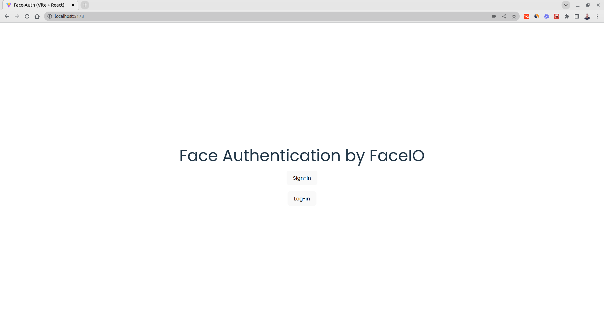
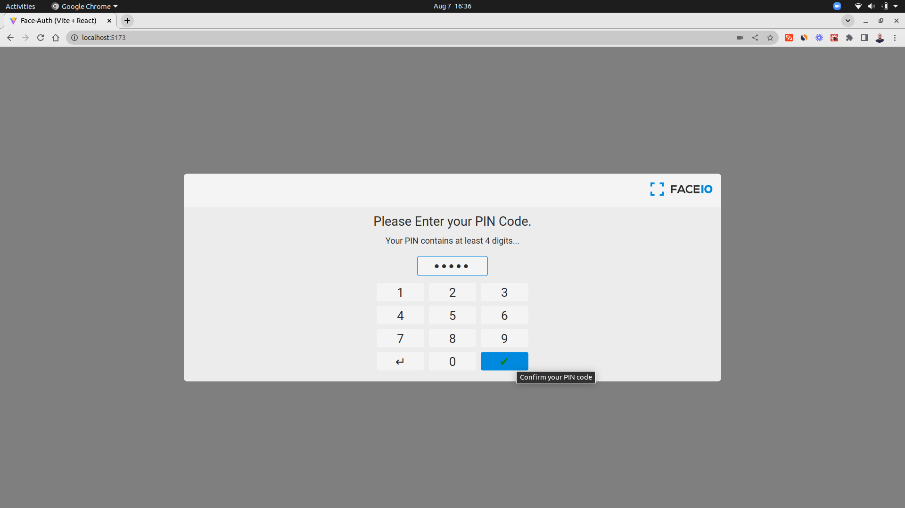

# Face-Auth



## Face Capture


## Verification


## Pin Code Capture



## Success


## Technologies

- [`React`](https://reactjs.org/)
- [`Vite`](https://vitejs.dev/)
- [`FaceIO (fio.js)`](https://faceio.net/getting-started)
- [`PixLab Insight`](https://pixlab.io)

## To run locally

- run the following commands

```code
# clone
git clone https://github.com/hesbon-osoro/face-auth.git

# install node_modules
cd face-auth && yarn

# run app
yarn dev
```

## Facial recognition authentication

Facial recognition is one of the latest authentication techniques, and many developers are adopting it these days. Facial recognition reduces the hassle of entering your email-password or any other user credentials to log in to a web application.

The most important thing is that this authentication system is fast and doesn't need any special hardware. You just need a webcam, which almost all devices have nowadays.

Facial recognition technology uses artificial intelligence to map out the unique facial details of a user and store them as a hash (some random numbers and text with no meaning) to reduce privacy-related issues.

Building and deploying an artificial intelligence-based face recognition model from scratch is not easy and can be very costly for indie developers and small startups. So you can use SaaS platforms to do all this heavy-lifting for you. FaceIO and AWS recognition are examples of these type of services you can use in your projects.

In this hands-on project, we are going to use FaceIO APIs to authenticate a user via facial recognition in a React web application. FaceIO gives you an easy way to integrate the authentication system with their fio.js JavaScript library.

## Privacy and FaceIO

Privacy is the most important thing for a user nowadays. As big corporations use your data for their good, questions arise on whether the privacy of these face recognition techniques is valid and legitimate.

FaceIO as a service follows all the privacy guidelines and gets user consent before requesting their camera access. Even if the developer wanted, FaceIO doesn't scan faces without getting consent. Users can easily opt-out of the system and can delete their facial data from the server.

FaceIO is CCP and GDPR compliant. As a developer, you can release this facial authentication system anywhere in the world without facing privacy issues. You can read this article to know more [about FaceIO privacy best practice](https://faceio.net/apps-best-practice).

## FaceIO Security

The security of a web application is an important topic to discuss and consider. As a developer, you are responsible for the security of a site or application's users.

FaceIO follows some important and serious security guidelines for user data protection. FaceIO hashes all the unique facial data of the user along with the payload we specified earlier. So the stored information is nothing but some random strings which can't be reverse engineered.

FaceIO outlines some very important [security guidelines](https://faceio.net/security-best-practice) for developers. Their security guide focuses on adding a strong pin code to protect user data. FaceIO also rejects covered faces so that no one can impersonate someone else.
